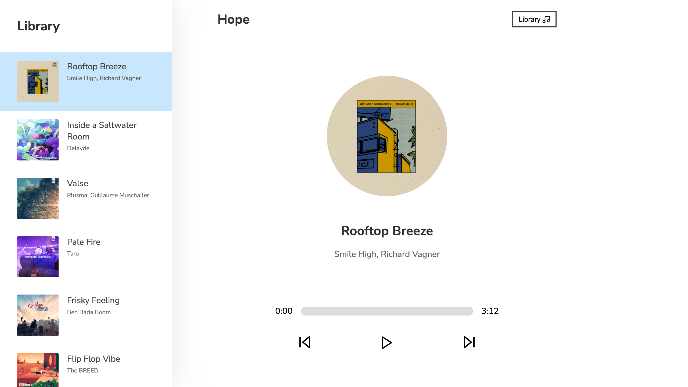

# Project Title
Hope | Music Player

## Demo link:
Access my site at [hope-music-player.netlify.app](hhttps://hope-music-player.netlify.app/)

## Table of Content:

- [About The App](#about-the-app)
- [Screenshots](#screenshots)
- [Technologies](#technologies)
- [Setup](#setup)
- [Status](#status)
- [Credits](#credits)

## About The App
This is an app that i build to practice my javascript and react skill by implementing music player functionality, such as skip song, autoplay, play and pause, dynamically change song highlight, and much more.

## Screenshots

## Technologies
`react`, `sass`

## Setup
- download or clone the repository
- run `npm install`
- then run `npm start` to runs the app in the development mode.
- open http://localhost:3000 to view it in the browser.

## Status
maybe i will add more functionality in the future.

## Credits
- [Dev Ed](https://github.com/developedbyed)
- [React Docs](https://reactjs.org/docs/getting-started.html)